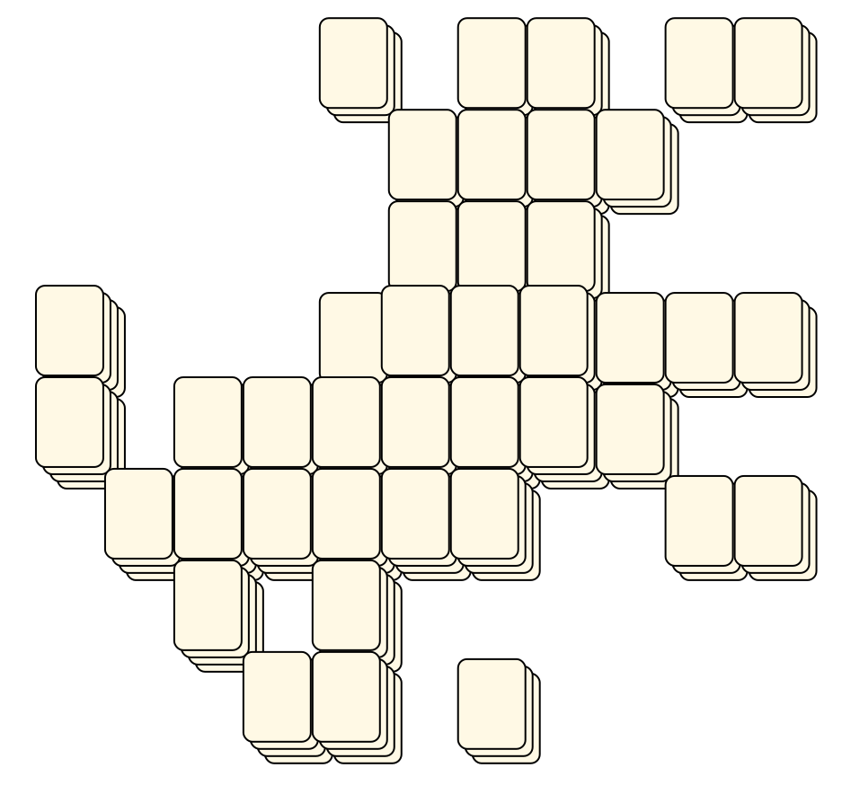
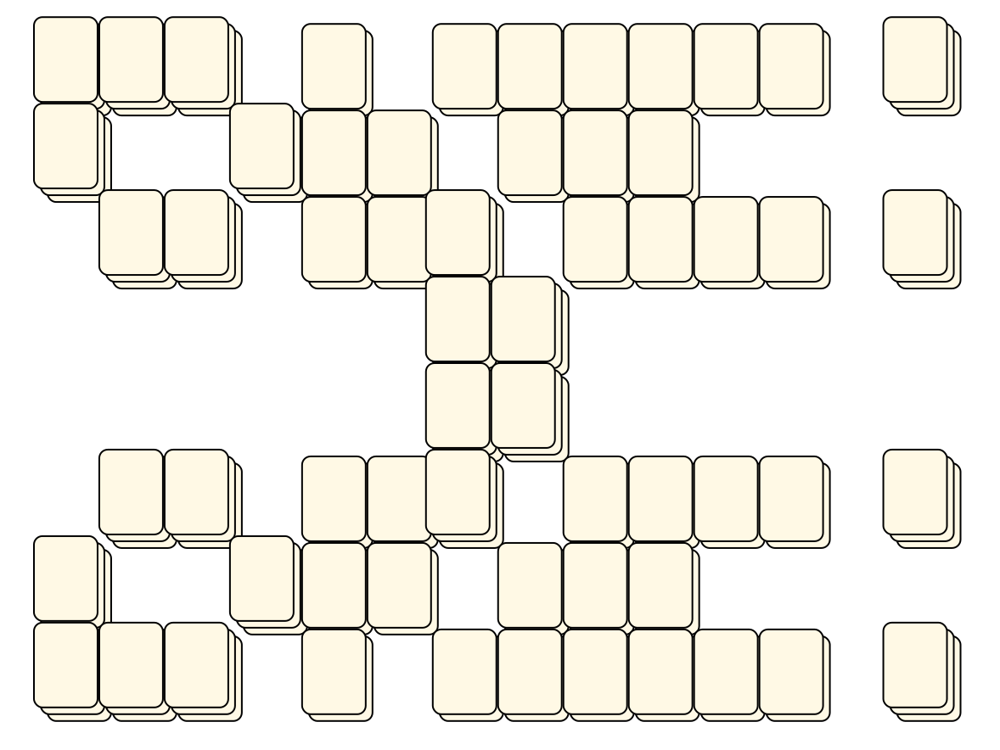
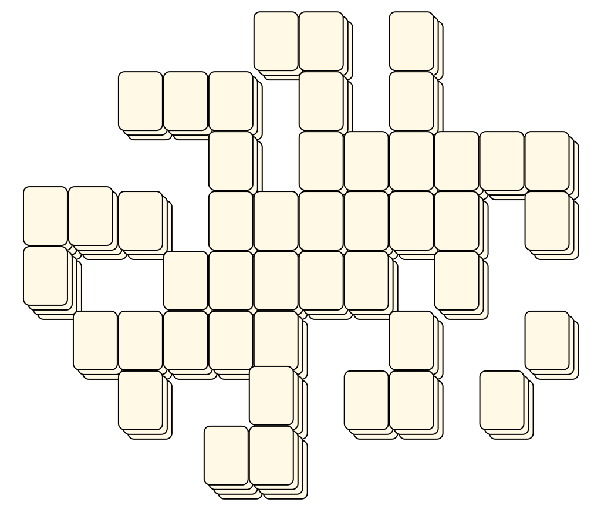

# Mahjong Solitaire Layout Museum: Atari 2600
* Source: [https://web.archive.org/web/20120408030546/http://members.fortunecity.com/phantagia/layouts.htm](https://web.archive.org/web/20120408030546/http://members.fortunecity.com/phantagia/layouts.htm)

* File Source:  
<sub>```https://web.archive.org/web/20120408030904/http://members.fortunecity.com/phantagia/layouts/eplayouts.zip#eplayza2600.zip```</sub>


|Atari 2600||Layouts: 12|
|:--:|:--:|:--:|
|Aquarius 2600<br><br> <sub>Atari</sub> <br>[.lay](./aquarius_2600_2.lay)  [.layout](./aquarius_2600_2.layout)  [.mah](./aquarius_2600_2.mah) |Aries 2600<br><br> <sub>Atari</sub> <br>[.lay](./aries_2600_2.lay)  [.layout](./aries_2600_2.layout)  [.mah](./aries_2600_2.mah) |Cancer 2600<br><br> <sub>Atari</sub> <br>[.lay](./cancer_2600_2.lay)  [.layout](./cancer_2600_2.layout)  [.mah](./cancer_2600_2.mah) |
|Capricorn 2600<br><br> <sub>Atari</sub> <br>[.lay](./capricorn_2600_2.lay)  [.layout](./capricorn_2600_2.layout)  [.mah](./capricorn_2600_2.mah) |Gemini 2600<br><br> <sub>Atari</sub> <br>[.lay](./gemini_2600_2.lay)  [.layout](./gemini_2600_2.layout)  [.mah](./gemini_2600_2.mah) |Leo 2600<br><br> <sub>Atari</sub> <br>[.lay](./leo_2600_2.lay)  [.layout](./leo_2600_2.layout)  [.mah](./leo_2600_2.mah) |
|Libra 2600<br><br> <sub>Atari</sub> <br>[.lay](./libra_2600_2.lay)  [.layout](./libra_2600_2.layout)  [.mah](./libra_2600_2.mah) |Pisces 2600<br><br> <sub>Atari</sub> <br>[.lay](./pisces_2600_2.lay)  [.layout](./pisces_2600_2.layout)  [.mah](./pisces_2600_2.mah) |Sagittarius 2600<br><br> <sub>Atari</sub> <br>[.lay](./sagittarius_2600_2.lay)  [.layout](./sagittarius_2600_2.layout)  [.mah](./sagittarius_2600_2.mah) |
|Scorpio 2600<br><br> <sub>Atari</sub> <br>[.lay](./scorpio_2600_2.lay)  [.layout](./scorpio_2600_2.layout)  [.mah](./scorpio_2600_2.mah) |Taurus 2600<br><br> <sub>Atari</sub> <br>[.lay](./taurus_2600_2.lay)  [.layout](./taurus_2600_2.layout)  [.mah](./taurus_2600_2.mah) |Virgo 2600<br><br> <sub>Atari</sub> <br>[.lay](./virgo_2600_2.lay)  [.layout](./virgo_2600_2.layout)  [.mah](./virgo_2600_2.mah) |