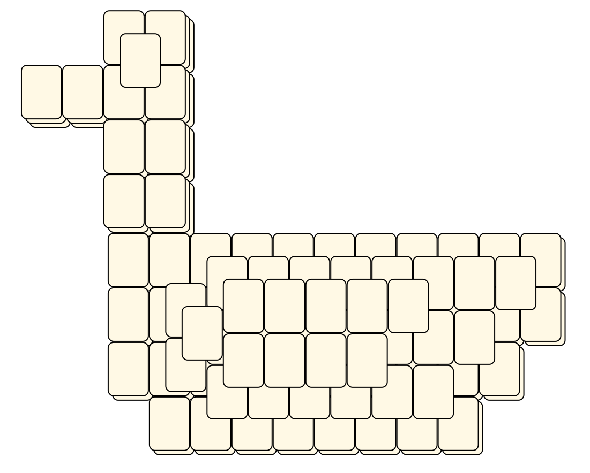
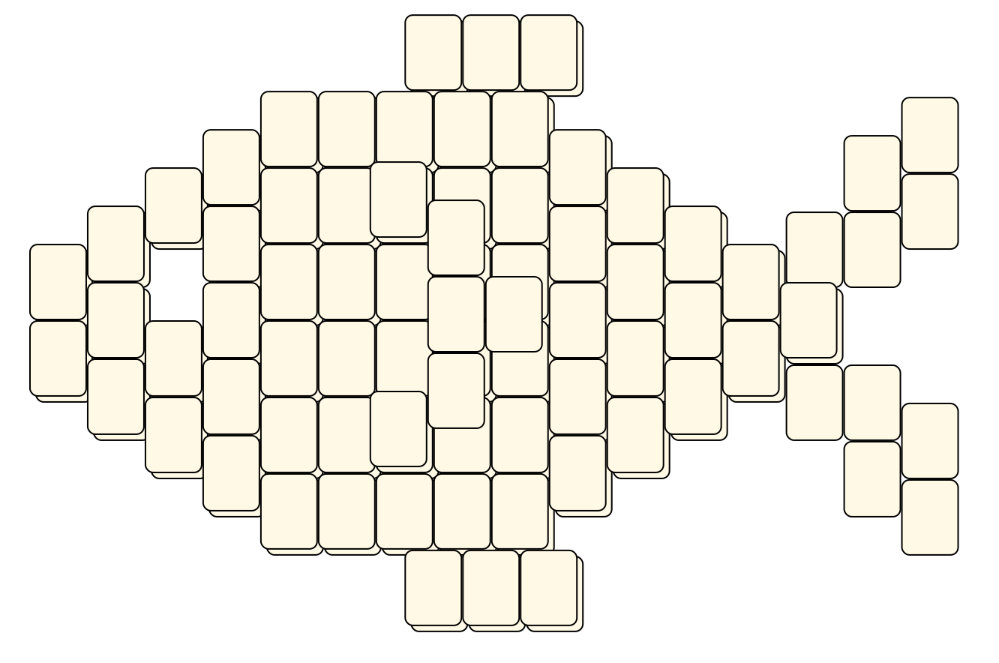
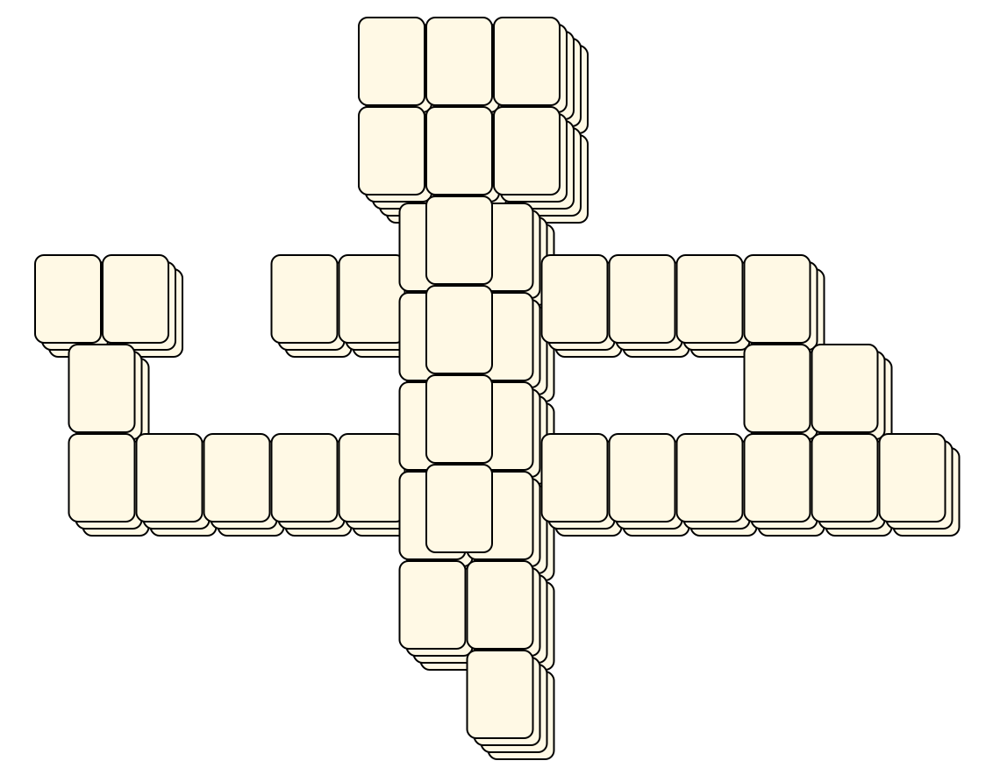
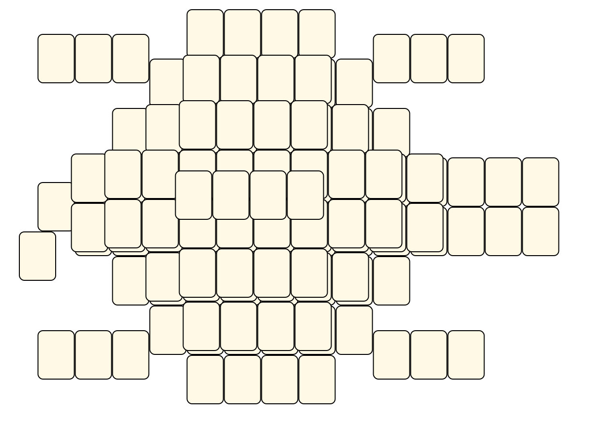
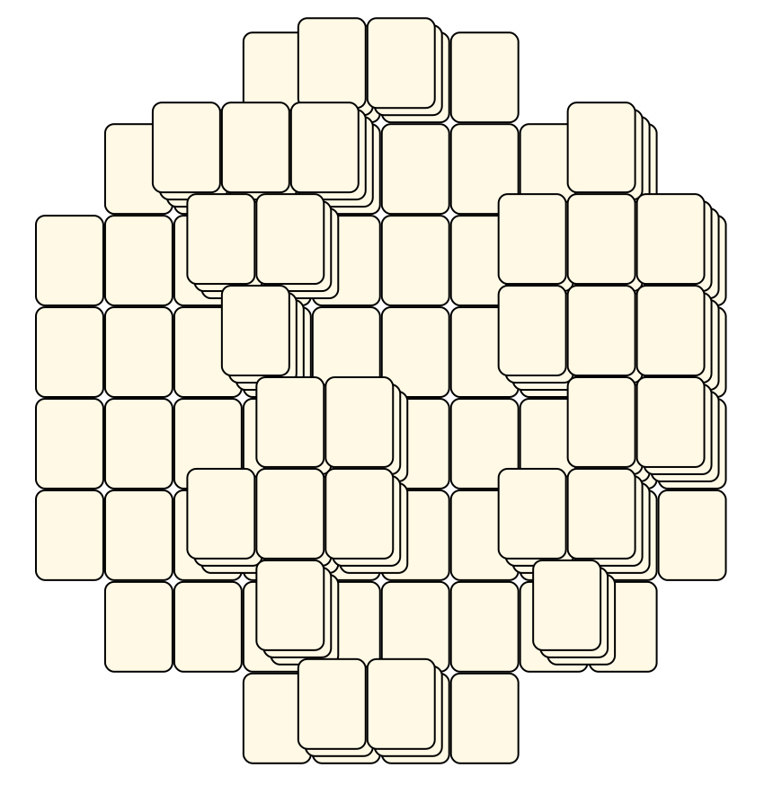
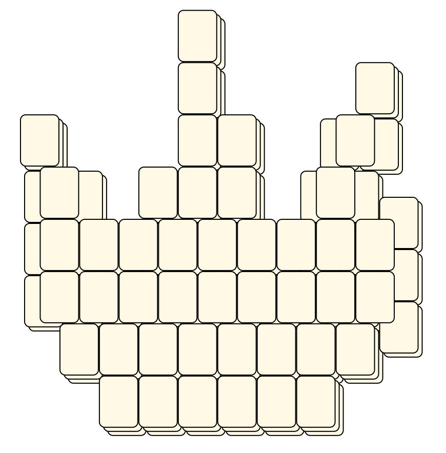

# Mahjong Solitaire Layout Museum: Mahjong
* Source: [https://web.archive.org/web/20120408030546/http://members.fortunecity.com/phantagia/layouts.htm](https://web.archive.org/web/20120408030546/http://members.fortunecity.com/phantagia/layouts.htm)

* File Source:  
<sub>```https://web.archive.org/web/20120408030904/http://members.fortunecity.com/phantagia/layouts/eplayouts.zip#eporacle01.zip```</sub>


|Mahjong||Layouts: 25|
|:--:|:--:|:--:|
|Bamboo<br><br> <sub>Ernie Polegato</sub> <br>[.lay](./bamboo_3.lay)  [.layout](./bamboo_3.layout)  [.mah](./bamboo_3.mah) |Bamboo 1<br><br> <sub>Ernie Polegato</sub> <br>[.lay](./bamboo_1.lay)  [.layout](./bamboo_1.layout)  [.mah](./bamboo_1.mah) |Bamboo 2<br><br> <sub>Ernie Polegato</sub> <br>[.lay](./bamboo_2.lay)  [.layout](./bamboo_2.layout)  [.mah](./bamboo_2.mah) |
|Bamboo 4<br><br> <sub>Ernie Polegato</sub> <br>[.lay](./bamboo_4.lay)  [.layout](./bamboo_4.layout)  [.mah](./bamboo_4.mah) |Bamboo 5<br><br> <sub>Ernie Polegato</sub> <br>[.lay](./bamboo_5.lay)  [.layout](./bamboo_5.layout)  [.mah](./bamboo_5.mah) |Bamboo 7<br><br> <sub>Ernie Polegato</sub> <br>[.lay](./bamboo_7.lay)  [.layout](./bamboo_7.layout)  [.mah](./bamboo_7.mah) |
|Bamboo 8<br><br> <sub>Ernie Polegato</sub> <br>[.lay](./bamboo_8.lay)  [.layout](./bamboo_8.layout)  [.mah](./bamboo_8.mah) |Chrysanthemum<br><br> <sub>Ernie Polegato</sub> <br>[.lay](./chrysanthemum.lay)  [.layout](./chrysanthemum.layout)  [.mah](./chrysanthemum.mah) |Circle 1<br><br> <sub>Ernie Polegato</sub> <br>[.lay](./circle_1.lay)  [.layout](./circle_1.layout)  [.mah](./circle_1.mah) |
|Circle 2<br><br> <sub>Ernie Polegato</sub> <br>[.lay](./circle_2.lay)  [.layout](./circle_2.layout)  [.mah](./circle_2.mah) |Circle 3<br><br> <sub>Ernie Polegato</sub> <br>[.lay](./circle_3.lay)  [.layout](./circle_3.layout)  [.mah](./circle_3.mah) |Circle 4<br><br> <sub>Ernie Polegato</sub> <br>[.lay](./circle_4.lay)  [.layout](./circle_4.layout)  [.mah](./circle_4.mah) |
|Circle 5<br><br> <sub>Ernie Polegato</sub> <br>[.lay](./circle_5.lay)  [.layout](./circle_5.layout)  [.mah](./circle_5.mah) |Circle 6<br><br> <sub>Ernie Polegato</sub> <br>[.lay](./circle_6.lay)  [.layout](./circle_6.layout)  [.mah](./circle_6.mah) |Circle 7<br><br> <sub>Ernie Polegato</sub> <br>[.lay](./circle_7.lay)  [.layout](./circle_7.layout)  [.mah](./circle_7.mah) |
|Orchid<br><br> <sub>Ernie Polegato</sub> <br>[.lay](./orchid.lay)  [.layout](./orchid.layout)  [.mah](./orchid.mah) |Plum Blossom<br><br> <sub>Ernie Polegato</sub> <br>[.lay](./plum_blossom.lay)  [.layout](./plum_blossom.layout)  [.mah](./plum_blossom.mah) |Red Dragon<br><br> <sub>Ernie Polegato</sub> <br>[.lay](./red_dragon_2.lay)  [.layout](./red_dragon_2.layout)  [.mah](./red_dragon_2.mah) |
|South Wind<br><br> <sub>Ernie Polegato</sub> <br>[.lay](./south_wind.lay)  [.layout](./south_wind.layout)  [.mah](./south_wind.mah) |Wan 3<br><br> <sub>Ernie Polegato</sub> <br>[.lay](./wan_3_2.lay)  [.layout](./wan_3_2.layout)  [.mah](./wan_3_2.mah) |Wan 5<br><br> <sub>Ernie Polegato</sub> <br>[.lay](./wan_5_2.lay)  [.layout](./wan_5_2.layout)  [.mah](./wan_5_2.mah) |
|Wan 6<br><br> <sub>Ernie Polegato</sub> <br>[.lay](./wan_6_2.lay)  [.layout](./wan_6_2.layout)  [.mah](./wan_6_2.mah) |Wan 8<br><br> <sub>Ernie Polegato</sub> <br>[.lay](./wan_8_2.lay)  [.layout](./wan_8_2.layout)  [.mah](./wan_8_2.mah) |White Dragon<br><br> <sub>Ernie Polegato</sub> <br>[.lay](./white_dragon_2.lay)  [.layout](./white_dragon_2.layout)  [.mah](./white_dragon_2.mah) |
|Winter<br><br> <sub>Ernie Polegato</sub> <br>[.lay](./winter_2.lay)  [.layout](./winter_2.layout)  [.mah](./winter_2.mah) |||