# Mahjong Solitaire Layout Museum: Submitted
* Source: [https://web.archive.org/web/20120408030546/http://members.fortunecity.com/phantagia/layouts.htm](https://web.archive.org/web/20120408030546/http://members.fortunecity.com/phantagia/layouts.htm)

* File Source:  
<sub>```https://web.archive.org/web/20120408030546/http://members.fortunecity.com/phantagia/layouts/lyall.zip```</sub>


## Chang
* Source: 
[https://web.archive.org/web/20120408030546/http://members.fortunecity.com/phantagia/layouts.htm](https://web.archive.org/web/20120408030546/http://members.fortunecity.com/phantagia/layouts.htm)

* File Source:  
<sub>```https://web.archive.org/web/20120408030546/http://members.fortunecity.com/phantagia/layouts/lyall.zip#chlayouts.zip```</sub>


|[chlayouts](chlayouts/README.md) ||Layouts: 2|
|:--:|:--:|:--:|
|Crossover<br><br> <sub>Eugene Chang</sub> <br>[.lay](./chlayouts/crossover_2.lay)  [.layout](./chlayouts/crossover_2.layout)  [.mah](./chlayouts/crossover_2.mah) |Great Wall Of Tiles<br><br> <sub>Eugene Chang</sub> <br>[.lay](./chlayouts/great_wall_of_tiles_2.lay)  [.layout](./chlayouts/great_wall_of_tiles_2.layout)  [.mah](./chlayouts/great_wall_of_tiles_2.mah) |

## Kamimura
* Source: 
[https://web.archive.org/web/20120408030546/http://members.fortunecity.com/phantagia/layouts.htm](https://web.archive.org/web/20120408030546/http://members.fortunecity.com/phantagia/layouts.htm)

* File Source:  
<sub>```https://web.archive.org/web/20120408030546/http://members.fortunecity.com/phantagia/layouts/lyall.zip#eclayouts.zip```</sub>


|[eclayouts](eclayouts/README.md) ||Layouts: 57|
|:--:|:--:|:--:|
|@<br><br> <sub>Nanami Kamimura</sub> <br>[.lay](./eclayouts/@_2.lay)  [.layout](./eclayouts/@_2.layout)  [.mah](./eclayouts/@_2.mah) |A REAL Pyramid, Finally<br><br> <sub>Nanami Kamimura</sub> <br>[.lay](./eclayouts/a_real_pyramid_finally_2.lay)  [.layout](./eclayouts/a_real_pyramid_finally_2.layout)  [.mah](./eclayouts/a_real_pyramid_finally_2.mah) |Abstractly Designed Bridge<br><br> <sub>Nanami Kamimura</sub> <br>[.lay](./eclayouts/abstractly_designed_bridge_2.lay)  [.layout](./eclayouts/abstractly_designed_bridge_2.layout)  [.mah](./eclayouts/abstractly_designed_bridge_2.mah) |
|Abstractly Designed Building<br><br> <sub>Nanami Kamimura</sub> <br>[.lay](./eclayouts/abstractly_designed_building_2.lay)  [.layout](./eclayouts/abstractly_designed_building_2.layout)  [.mah](./eclayouts/abstractly_designed_building_2.mah) |Abstractly Designed Pyramid<br><br> <sub>Nanami Kamimura</sub> <br>[.lay](./eclayouts/abstractly_designed_pyramid_2.lay)  [.layout](./eclayouts/abstractly_designed_pyramid_2.layout)  [.mah](./eclayouts/abstractly_designed_pyramid_2.mah) |Abstractly Designed Staircase<br><br> <sub>Nanami Kamimura</sub> <br>[.lay](./eclayouts/abstractly_designed_staircase_2.lay)  [.layout](./eclayouts/abstractly_designed_staircase_2.layout)  [.mah](./eclayouts/abstractly_designed_staircase_2.mah) |
|Akane (in Kanji)<br><br> <sub>Nanami Kamimura</sub> <br>[.lay](./eclayouts/akane_(in_kanji)_2.lay)  [.layout](./eclayouts/akane_(in_kanji)_2.layout)  [.mah](./eclayouts/akane_(in_kanji)_2.mah) |Angel<br><br> <sub>Nanami Kamimura</sub> <br>[.lay](./eclayouts/angel_3.lay)  [.layout](./eclayouts/angel_3.layout)  [.mah](./eclayouts/angel_3.mah) |Bei<br><br> <sub>Nanami Kamimura</sub> <br>[.lay](./eclayouts/bei_4.lay)  [.layout](./eclayouts/bei_4.layout)  [.mah](./eclayouts/bei_4.mah) |
|Ceremonial Well<br><br> <sub>Nanami Kamimura</sub> <br>[.lay](./eclayouts/ceremonial_well_2.lay)  [.layout](./eclayouts/ceremonial_well_2.layout)  [.mah](./eclayouts/ceremonial_well_2.mah) |Colesseum<br><br> <sub>Nanami Kamimura</sub> <br>[.lay](./eclayouts/colesseum_2.lay)  [.layout](./eclayouts/colesseum_2.layout)  [.mah](./eclayouts/colesseum_2.mah) |Dance Dance Revolution<br><br> <sub>Nanami Kamimura</sub> <br>[.lay](./eclayouts/dance_dance_revolution_2.lay)  [.layout](./eclayouts/dance_dance_revolution_2.layout)  [.mah](./eclayouts/dance_dance_revolution_2.mah) |
|Diagonal Checkered Layout<br><br> <sub>Nanami Kamimura</sub> <br>[.lay](./eclayouts/diagonal_checkered_layout_2.lay)  [.layout](./eclayouts/diagonal_checkered_layout_2.layout)  [.mah](./eclayouts/diagonal_checkered_layout_2.mah) |Dong<br><br> <sub>Nanami Kamimura</sub> <br>[.lay](./eclayouts/dong_4.lay)  [.layout](./eclayouts/dong_4.layout)  [.mah](./eclayouts/dong_4.mah) |Double Pyramid<br><br> <sub>Nanami Kamimura</sub> <br>[.lay](./eclayouts/double_pyramid_2.lay)  [.layout](./eclayouts/double_pyramid_2.layout)  [.mah](./eclayouts/double_pyramid_2.mah) |
|Eight Stacks<br><br> <sub>Nanami Kamimura</sub> <br>[.lay](./eclayouts/eight_stacks_3.lay)  [.layout](./eclayouts/eight_stacks_3.layout)  [.mah](./eclayouts/eight_stacks_3.mah) |Flat Iron<br><br> <sub>Nanami Kamimura</sub> <br>[.lay](./eclayouts/flat_iron_2.lay)  [.layout](./eclayouts/flat_iron_2.layout)  [.mah](./eclayouts/flat_iron_2.mah) |For The Sake Of Symmetry<br><br> <sub>Nanami Kamimura</sub> <br>[.lay](./eclayouts/for_the_sake_of_symmetry_2.lay)  [.layout](./eclayouts/for_the_sake_of_symmetry_2.layout)  [.mah](./eclayouts/for_the_sake_of_symmetry_2.mah) |
|Fort Boyard<br><br> <sub>Nanami Kamimura</sub> <br>[.lay](./eclayouts/fort_boyard_2.lay)  [.layout](./eclayouts/fort_boyard_2.layout)  [.mah](./eclayouts/fort_boyard_2.mah) |Four Chipped Pyramids<br>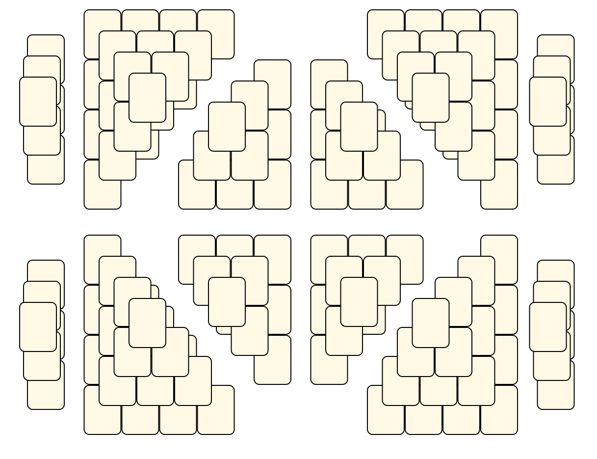<br> <sub>Nanami Kamimura</sub> <br>[.lay](./eclayouts/four_chipped_pyramids_2.lay)  [.layout](./eclayouts/four_chipped_pyramids_2.layout)  [.mah](./eclayouts/four_chipped_pyramids_2.mah) |Four Pyramids<br><br> <sub>Nanami Kamimura</sub> <br>[.lay](./eclayouts/four_pyramids_3.lay)  [.layout](./eclayouts/four_pyramids_3.layout)  [.mah](./eclayouts/four_pyramids_3.mah) |
|Guess Who Loves Tamahome!<br><br> <sub>Nanami Kamimura</sub> <br>[.lay](./eclayouts/guess_who_loves_tamahome_2.lay)  [.layout](./eclayouts/guess_who_loves_tamahome_2.layout)  [.mah](./eclayouts/guess_who_loves_tamahome_2.mah) |Guo<br><br> <sub>Nanami Kamimura</sub> <br>[.lay](./eclayouts/guo_2.lay)  [.layout](./eclayouts/guo_2.layout)  [.mah](./eclayouts/guo_2.mah) |I Love You Sign<br>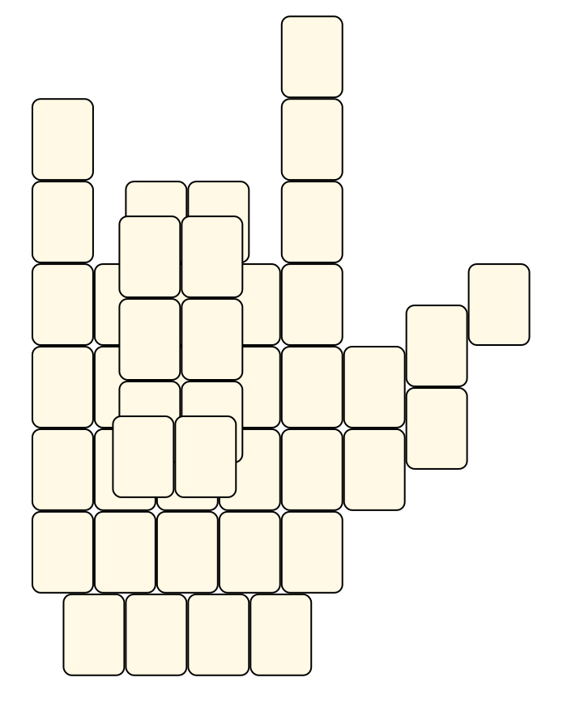<br> <sub>Nanami Kamimura</sub> <br>[.lay](./eclayouts/i_love_you_sign_2.lay)  [.layout](./eclayouts/i_love_you_sign_2.layout)  [.mah](./eclayouts/i_love_you_sign_2.mah) |
|Il-Bul<br><br> <sub>Nanami Kamimura</sub> <br>[.lay](./eclayouts/il-bul_2.lay)  [.layout](./eclayouts/il-bul_2.layout)  [.mah](./eclayouts/il-bul_2.mah) |Inverted Pyramid With Front<br><br> <sub>Nanami Kamimura</sub> <br>[.lay](./eclayouts/inverted_pyramid_with_front_2.lay)  [.layout](./eclayouts/inverted_pyramid_with_front_2.layout)  [.mah](./eclayouts/inverted_pyramid_with_front_2.mah) |Jusenkyo<br><br> <sub>Nanami Kamimura</sub> <br>[.lay](./eclayouts/jusenkyo_2.lay)  [.layout](./eclayouts/jusenkyo_2.layout)  [.mah](./eclayouts/jusenkyo_2.mah) |
|Kenshins Sword<br><br> <sub>Nanami Kamimura</sub> <br>[.lay](./eclayouts/kenshins_sword_2.lay)  [.layout](./eclayouts/kenshins_sword_2.layout)  [.mah](./eclayouts/kenshins_sword_2.mah) |Keys Of Fort Boyard<br><br> <sub>Nanami Kamimura</sub> <br>[.lay](./eclayouts/keys_of_fort_boyard_2.lay)  [.layout](./eclayouts/keys_of_fort_boyard_2.layout)  [.mah](./eclayouts/keys_of_fort_boyard_2.mah) |Little Stairway<br><br> <sub>Nanami Kamimura</sub> <br>[.lay](./eclayouts/little_stairway_2.lay)  [.layout](./eclayouts/little_stairway_2.layout)  [.mah](./eclayouts/little_stairway_2.mah) |
|Mei<br><br> <sub>Nanami Kamimura</sub> <br>[.lay](./eclayouts/mei_2.lay)  [.layout](./eclayouts/mei_2.layout)  [.mah](./eclayouts/mei_2.mah) |Michael Jordans Number<br><br> <sub>Nanami Kamimura</sub> <br>[.lay](./eclayouts/michael_jordans_number_2.lay)  [.layout](./eclayouts/michael_jordans_number_2.layout)  [.mah](./eclayouts/michael_jordans_number_2.mah) |Nan<br><br> <sub>Nanami Kamimura</sub> <br>[.lay](./eclayouts/nan_4.lay)  [.layout](./eclayouts/nan_4.layout)  [.mah](./eclayouts/nan_4.mah) |
|Om<br>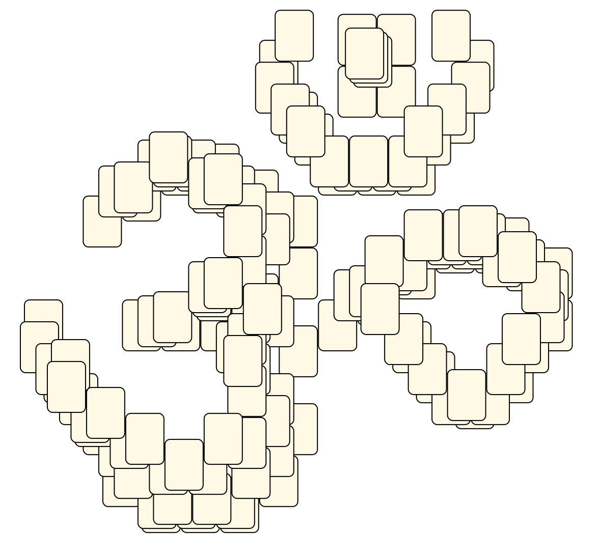<br> <sub>Nanami Kamimura</sub> <br>[.lay](./eclayouts/om_2.lay)  [.layout](./eclayouts/om_2.layout)  [.mah](./eclayouts/om_2.mah) |Otarus Sword<br><br> <sub>Nanami Kamimura</sub> <br>[.lay](./eclayouts/otarus_sword_2.lay)  [.layout](./eclayouts/otarus_sword_2.layout)  [.mah](./eclayouts/otarus_sword_2.mah) |Peace Symbol<br><br> <sub>Nanami Kamimura</sub> <br>[.lay](./eclayouts/peace_symbol_2.lay)  [.layout](./eclayouts/peace_symbol_2.layout)  [.mah](./eclayouts/peace_symbol_2.mah) |
|Pikachu<br>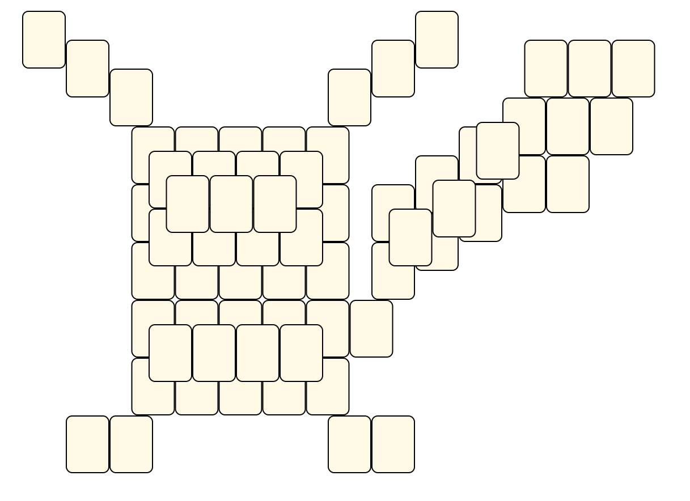<br> <sub>Nanami Kamimura</sub> <br>[.lay](./eclayouts/pikachu_2.lay)  [.layout](./eclayouts/pikachu_2.layout)  [.mah](./eclayouts/pikachu_2.mah) |Qi<br><br> <sub>Nanami Kamimura</sub> <br>[.lay](./eclayouts/qi_2.lay)  [.layout](./eclayouts/qi_2.layout)  [.mah](./eclayouts/qi_2.mah) |Rivers... To You!<br><br> <sub>Nanami Kamimura</sub> <br>[.lay](./eclayouts/rivers__to_you_2.lay)  [.layout](./eclayouts/rivers__to_you_2.layout)  [.mah](./eclayouts/rivers__to_you_2.mah) |
|Sailorchibimoons Symbol<br><br> <sub>Nanami Kamimura</sub> <br>[.lay](./eclayouts/sailorchibimoons_symbol_2.lay)  [.layout](./eclayouts/sailorchibimoons_symbol_2.layout)  [.mah](./eclayouts/sailorchibimoons_symbol_2.mah) |Sailormoons Symbol<br><br> <sub>Nanami Kamimura</sub> <br>[.lay](./eclayouts/sailormoons_symbol_2.lay)  [.layout](./eclayouts/sailormoons_symbol_2.layout)  [.mah](./eclayouts/sailormoons_symbol_2.mah) |Seven INVERTED Pyramids<br><br> <sub>Nanami Kamimura</sub> <br>[.lay](./eclayouts/seven_inverted_pyramids_2.lay)  [.layout](./eclayouts/seven_inverted_pyramids_2.layout)  [.mah](./eclayouts/seven_inverted_pyramids_2.mah) |
|Smiley Face<br><br> <sub>Nanami Kamimura</sub> <br>[.lay](./eclayouts/smiley_face_2.lay)  [.layout](./eclayouts/smiley_face_2.layout)  [.mah](./eclayouts/smiley_face_2.mah) |Staircase<br><br> <sub>Nanami Kamimura</sub> <br>[.lay](./eclayouts/staircase_3.lay)  [.layout](./eclayouts/staircase_3.layout)  [.mah](./eclayouts/staircase_3.mah) |Staircase 2<br><br> <sub>Nanami Kamimura</sub> <br>[.lay](./eclayouts/staircase_2_2.lay)  [.layout](./eclayouts/staircase_2_2.layout)  [.mah](./eclayouts/staircase_2_2.mah) |
|Symmetrically Designed Building<br><br> <sub>Nanami Kamimura</sub> <br>[.lay](./eclayouts/symmetrically_designed_building_2.lay)  [.layout](./eclayouts/symmetrically_designed_building_2.layout)  [.mah](./eclayouts/symmetrically_designed_building_2.mah) |Three Boxes<br><br> <sub>Nanami Kamimura</sub> <br>[.lay](./eclayouts/three_boxes_2.lay)  [.layout](./eclayouts/three_boxes_2.layout)  [.mah](./eclayouts/three_boxes_2.mah) |Three ELEVATED Wells<br><br> <sub>Nanami Kamimura</sub> <br>[.lay](./eclayouts/three_elevated_wells_2.lay)  [.layout](./eclayouts/three_elevated_wells_2.layout)  [.mah](./eclayouts/three_elevated_wells_2.mah) |
|Three Pyramids<br>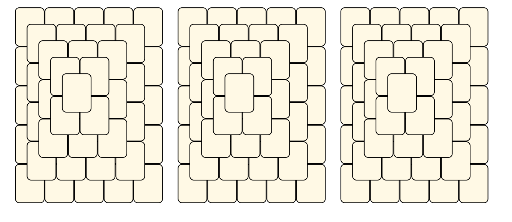<br> <sub>Nanami Kamimura</sub> <br>[.lay](./eclayouts/three_pyramids_3.lay)  [.layout](./eclayouts/three_pyramids_3.layout)  [.mah](./eclayouts/three_pyramids_3.mah) |Togepi<br>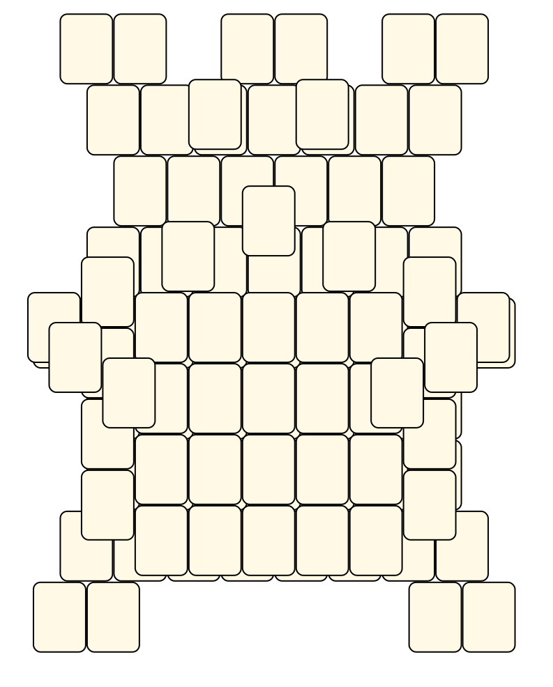<br> <sub>Nanami Kamimura</sub> <br>[.lay](./eclayouts/togepi_2.lay)  [.layout](./eclayouts/togepi_2.layout)  [.mah](./eclayouts/togepi_2.mah) |Top View Of Titanic<br><br> <sub>Nanami Kamimura</sub> <br>[.lay](./eclayouts/top_view_of_titanic_2.lay)  [.layout](./eclayouts/top_view_of_titanic_2.layout)  [.mah](./eclayouts/top_view_of_titanic_2.mah) |
|Two Walls<br>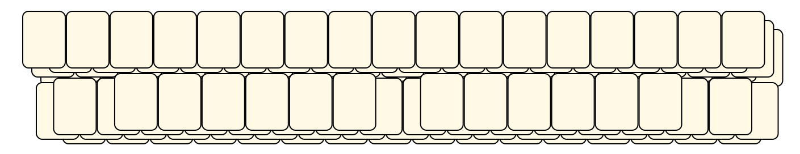<br> <sub>Nanami Kamimura</sub> <br>[.lay](./eclayouts/two_walls_2.lay)  [.layout](./eclayouts/two_walls_2.layout)  [.mah](./eclayouts/two_walls_2.mah) |U For Usagi<br><br> <sub>Nanami Kamimura</sub> <br>[.lay](./eclayouts/u_for_usagi_2.lay)  [.layout](./eclayouts/u_for_usagi_2.layout)  [.mah](./eclayouts/u_for_usagi_2.mah) |U For Usagi Traditional<br><br> <sub>Nanami Kamimura</sub> <br>[.lay](./eclayouts/u_for_usagi_traditional_2.lay)  [.layout](./eclayouts/u_for_usagi_traditional_2.layout)  [.mah](./eclayouts/u_for_usagi_traditional_2.mah) |
|Victory / Peace Sign<br><br> <sub>Nanami Kamimura</sub> <br>[.lay](./eclayouts/victory__peace_sign_2.lay)  [.layout](./eclayouts/victory__peace_sign_2.layout)  [.mah](./eclayouts/victory__peace_sign_2.mah) |Xi<br><br> <sub>Nanami Kamimura</sub> <br>[.lay](./eclayouts/xi_4.lay)  [.layout](./eclayouts/xi_4.layout)  [.mah](./eclayouts/xi_4.mah) |Zhong<br><br> <sub>Nanami Kamimura</sub> <br>[.lay](./eclayouts/zhong_2.lay)  [.layout](./eclayouts/zhong_2.layout)  [.mah](./eclayouts/zhong_2.mah) |

## Sanna
* Source: 
[https://web.archive.org/web/20120408030546/http://members.fortunecity.com/phantagia/layouts.htm](https://web.archive.org/web/20120408030546/http://members.fortunecity.com/phantagia/layouts.htm)

* File Source:  
<sub>```https://web.archive.org/web/20120408030546/http://members.fortunecity.com/phantagia/layouts/lyall.zip#lychall.zip```</sub>


|[lychall](lychall/README.md) ||Layouts: 1|
|:--:|:--:|:--:|
|Challenger<br><br> <sub>Jeanette Sanna</sub> <br>[.lay](./lychall/challenger.lay)  [.layout](./lychall/challenger.layout)  [.mah](./lychall/challenger.mah) |

## Jones
* Source: 
[https://web.archive.org/web/20120408030546/http://members.fortunecity.com/phantagia/layouts.htm](https://web.archive.org/web/20120408030546/http://members.fortunecity.com/phantagia/layouts.htm)

* File Source:  
<sub>```https://web.archive.org/web/20120408030546/http://members.fortunecity.com/phantagia/layouts/lyall.zip#lycows.zip```</sub>


|[lycows](lycows/README.md) ||Layouts: 1|
|:--:|:--:|:--:|
|Moo<br>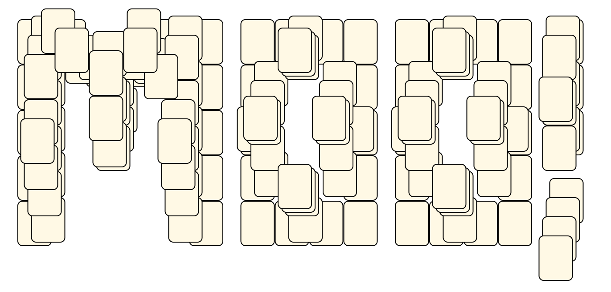<br> <sub>Sharon Jones</sub> <br>[.lay](./lycows/moo_2.lay)  [.layout](./lycows/moo_2.layout)  [.mah](./lycows/moo_2.mah) |

## Lesselberg
* Source: 
[https://web.archive.org/web/20120408030546/http://members.fortunecity.com/phantagia/layouts.htm](https://web.archive.org/web/20120408030546/http://members.fortunecity.com/phantagia/layouts.htm)

* File Source:  
<sub>```https://web.archive.org/web/20120408030546/http://members.fortunecity.com/phantagia/layouts/lyall.zip#mllayouts.zip```</sub>


|[mllayouts](mllayouts/README.md) ||Layouts: 10|
|:--:|:--:|:--:|
|Deux Chevaux<br>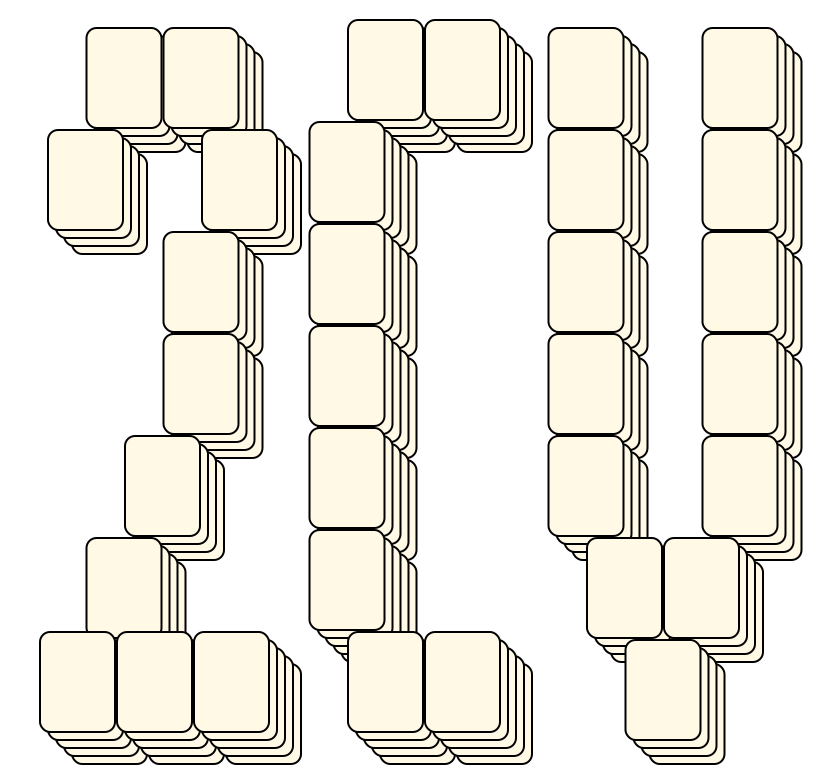<br> <sub>Marc Lesselberg</sub> <br>[.lay](./mllayouts/deux_chevaux_2.lay)  [.layout](./mllayouts/deux_chevaux_2.layout)  [.mah](./mllayouts/deux_chevaux_2.mah) |Dollar<br><br> <sub>Marc Lesselberg</sub> <br>[.lay](./mllayouts/dollar_4.lay)  [.layout](./mllayouts/dollar_4.layout)  [.mah](./mllayouts/dollar_4.mah) |Domino<br><br> <sub>Marc Lesselberg</sub> <br>[.lay](./mllayouts/domino_2.lay)  [.layout](./mllayouts/domino_2.layout)  [.mah](./mllayouts/domino_2.mah) |
|Envelope<br><br> <sub>Marc Lesselberg</sub> <br>[.lay](./mllayouts/envelope_2.lay)  [.layout](./mllayouts/envelope_2.layout)  [.mah](./mllayouts/envelope_2.mah) |Large Width Tilesets<br><br> <sub>Marc Lesselberg</sub> <br>[.lay](./mllayouts/large_width_tilesets_2.lay)  [.layout](./mllayouts/large_width_tilesets_2.layout)  [.mah](./mllayouts/large_width_tilesets_2.mah) |Letters<br><br> <sub>Marc Lesselberg</sub> <br>[.lay](./mllayouts/letters_2.lay)  [.layout](./mllayouts/letters_2.layout)  [.mah](./mllayouts/letters_2.mah) |
|Mahjongg<br><br> <sub>Marc Lesselberg</sub> <br>[.lay](./mllayouts/mahjongg_2.lay)  [.layout](./mllayouts/mahjongg_2.layout)  [.mah](./mllayouts/mahjongg_2.mah) |Monopoly<br><br> <sub>Marc Lesselberg</sub> <br>[.lay](./mllayouts/monopoly_2.lay)  [.layout](./mllayouts/monopoly_2.layout)  [.mah](./mllayouts/monopoly_2.mah) |Moorhuhn Reticule<br><br> <sub>Marc Lesselberg</sub> <br>[.lay](./mllayouts/moorhuhn_reticule_2.lay)  [.layout](./mllayouts/moorhuhn_reticule_2.layout)  [.mah](./mllayouts/moorhuhn_reticule_2.mah) |
|Oracle<br><br> <sub>Marc Lesselberg</sub> <br>[.lay](./mllayouts/oracle_2.lay)  [.layout](./mllayouts/oracle_2.layout)  [.mah](./mllayouts/oracle_2.mah) |||

## Ottosson
* Source: 
[https://web.archive.org/web/20120408030546/http://members.fortunecity.com/phantagia/layouts.htm](https://web.archive.org/web/20120408030546/http://members.fortunecity.com/phantagia/layouts.htm)

* File Source:  
<sub>```https://web.archive.org/web/20120408030546/http://members.fortunecity.com/phantagia/layouts/lyall.zip#molayouts.zip```</sub>


|[molayouts](molayouts/README.md) ||Layouts: 6|
|:--:|:--:|:--:|
|12 Bars<br>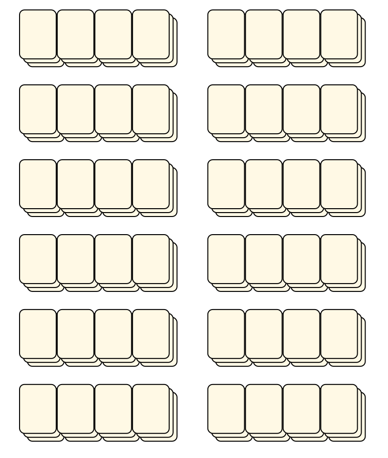<br> <sub>Monica Ottosson</sub> <br>[.lay](./molayouts/12_bars_2.lay)  [.layout](./molayouts/12_bars_2.layout)  [.mah](./molayouts/12_bars_2.mah) |144<br><br> <sub>Monica Ottosson</sub> <br>[.lay](./molayouts/144_2.lay)  [.layout](./molayouts/144_2.layout)  [.mah](./molayouts/144_2.mah) |3 X 6<br><br> <sub>Monica Ottosson</sub> <br>[.lay](./molayouts/3_x_6_2.lay)  [.layout](./molayouts/3_x_6_2.layout)  [.mah](./molayouts/3_x_6_2.mah) |
|6 Bars<br><br> <sub>Monica Ottosson</sub> <br>[.lay](./molayouts/6_bars_2.lay)  [.layout](./molayouts/6_bars_2.layout)  [.mah](./molayouts/6_bars_2.mah) |9 Bars<br><br> <sub>Monica Ottosson</sub> <br>[.lay](./molayouts/9_bars_2.lay)  [.layout](./molayouts/9_bars_2.layout)  [.mah](./molayouts/9_bars_2.mah) |PC<br><br> <sub>Monica Ottosson</sub> <br>[.lay](./molayouts/pc_3.lay)  [.layout](./molayouts/pc_3.layout)  [.mah](./molayouts/pc_3.mah) |

## Ulixes
* Source: 
[https://web.archive.org/web/20120408030546/http://members.fortunecity.com/phantagia/layouts.htm](https://web.archive.org/web/20120408030546/http://members.fortunecity.com/phantagia/layouts.htm)

* File Source:  
<sub>```https://web.archive.org/web/20120408030546/http://members.fortunecity.com/phantagia/layouts/lyall.zip#ulayouts.zip```</sub>


|[ulayouts](ulayouts/README.md) ||Layouts: 1|
|:--:|:--:|:--:|
|San Wells<br>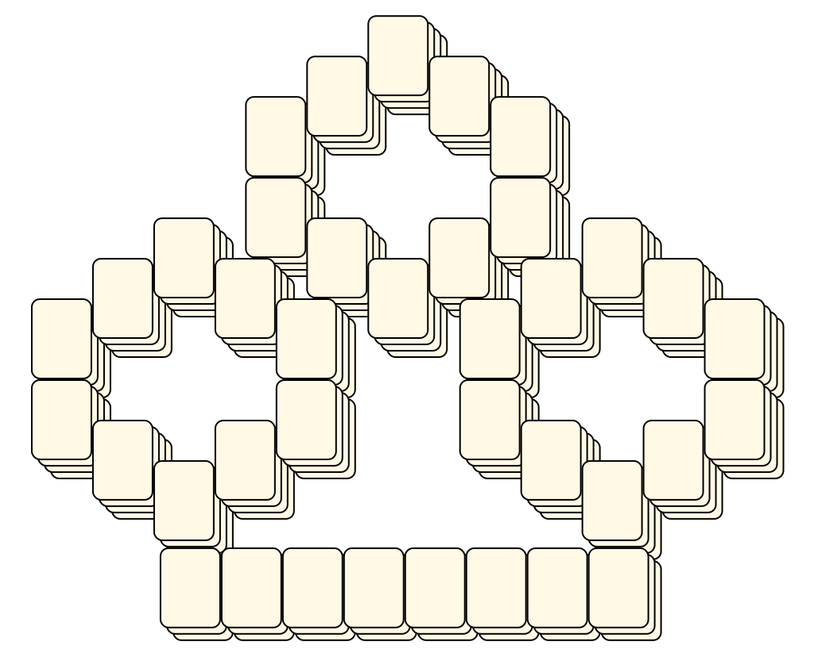<br> <sub>Ulixes</sub> <br>[.lay](./ulayouts/san_wells.lay)  [.layout](./ulayouts/san_wells.layout)  [.mah](./ulayouts/san_wells.mah) |

## Bushell
* Source: 
[https://web.archive.org/web/20120408030546/http://members.fortunecity.com/phantagia/layouts.htm](https://web.archive.org/web/20120408030546/http://members.fortunecity.com/phantagia/layouts.htm)

* File Source:  
<sub>```https://web.archive.org/web/20120408030546/http://members.fortunecity.com/phantagia/layouts/lyall.zip#vblayouts.zip```</sub>


|[vblayouts](vblayouts/README.md) ||Layouts: 8|
|:--:|:--:|:--:|
|Butterfly<br>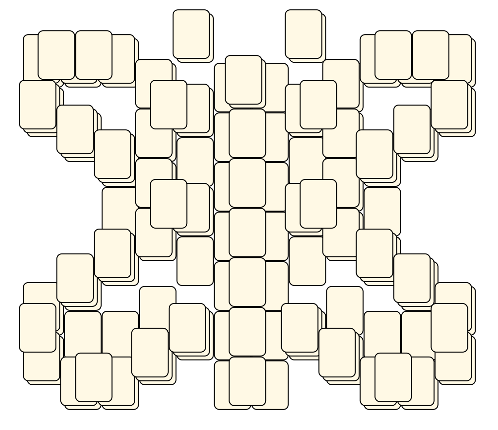<br> <sub>Vivian Bushell</sub> <br>[.lay](./vblayouts/butterfly_5.lay)  [.layout](./vblayouts/butterfly_5.layout)  [.mah](./vblayouts/butterfly_5.mah) |Cobra<br>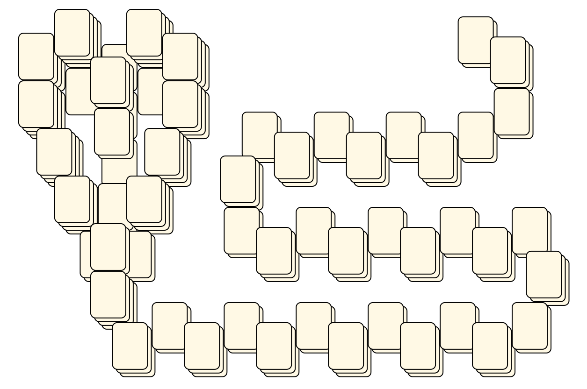<br> <sub>Vivian Bushell</sub> <br>[.lay](./vblayouts/cobra.lay)  [.layout](./vblayouts/cobra.layout)  [.mah](./vblayouts/cobra.mah) |Elephant<br><br> <sub>Vivian Bushell</sub> <br>[.lay](./vblayouts/elephant.lay)  [.layout](./vblayouts/elephant.layout)  [.mah](./vblayouts/elephant.mah) |
|Fish<br><br> <sub>Vivian Bushell</sub> <br>[.lay](./vblayouts/fish_3.lay)  [.layout](./vblayouts/fish_3.layout)  [.mah](./vblayouts/fish_3.mah) |Hawk<br><br> <sub>Vivian Bushell</sub> <br>[.lay](./vblayouts/hawk.lay)  [.layout](./vblayouts/hawk.layout)  [.mah](./vblayouts/hawk.mah) |Phoenix<br><br> <sub>Vivian Bushell</sub> <br>[.lay](./vblayouts/phoenix_4.lay)  [.layout](./vblayouts/phoenix_4.layout)  [.mah](./vblayouts/phoenix_4.mah) |
|Spiral<br><br> <sub>Vivian Bushell</sub> <br>[.lay](./vblayouts/spiral_2.lay)  [.layout](./vblayouts/spiral_2.layout)  [.mah](./vblayouts/spiral_2.mah) |Waffle<br>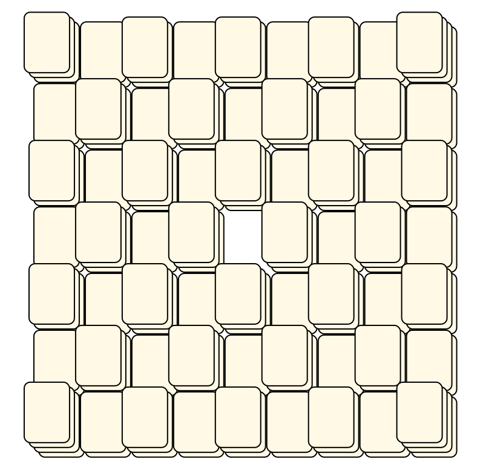<br> <sub>Vivian Bushell</sub> <br>[.lay](./vblayouts/waffle.lay)  [.layout](./vblayouts/waffle.layout)  [.mah](./vblayouts/waffle.mah) ||