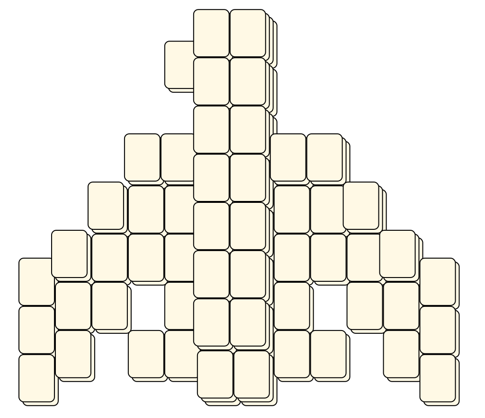

# Mahjong Solitaire Layout Museum: Bushell
* Source: [https://web.archive.org/web/20120408030546/http://members.fortunecity.com/phantagia/layouts.htm](https://web.archive.org/web/20120408030546/http://members.fortunecity.com/phantagia/layouts.htm)

* File Source:  
<sub>```https://web.archive.org/web/20120408030546/http://members.fortunecity.com/phantagia/layouts/lyall.zip#vblayouts.zip```</sub>


|Bushell||Layouts: 8|
|:--:|:--:|:--:|
|Butterfly<br><br> <sub>Vivian Bushell</sub> <br>[.lay](./butterfly_5.lay)  [.layout](./butterfly_5.layout)  [.mah](./butterfly_5.mah) |Cobra<br><br> <sub>Vivian Bushell</sub> <br>[.lay](./cobra.lay)  [.layout](./cobra.layout)  [.mah](./cobra.mah) |Elephant<br><br> <sub>Vivian Bushell</sub> <br>[.lay](./elephant.lay)  [.layout](./elephant.layout)  [.mah](./elephant.mah) |
|Fish<br><br> <sub>Vivian Bushell</sub> <br>[.lay](./fish_3.lay)  [.layout](./fish_3.layout)  [.mah](./fish_3.mah) |Hawk<br><br> <sub>Vivian Bushell</sub> <br>[.lay](./hawk.lay)  [.layout](./hawk.layout)  [.mah](./hawk.mah) |Phoenix<br><br> <sub>Vivian Bushell</sub> <br>[.lay](./phoenix_4.lay)  [.layout](./phoenix_4.layout)  [.mah](./phoenix_4.mah) |
|Spiral<br><br> <sub>Vivian Bushell</sub> <br>[.lay](./spiral_2.lay)  [.layout](./spiral_2.layout)  [.mah](./spiral_2.mah) |Waffle<br><br> <sub>Vivian Bushell</sub> <br>[.lay](./waffle.lay)  [.layout](./waffle.layout)  [.mah](./waffle.mah) ||